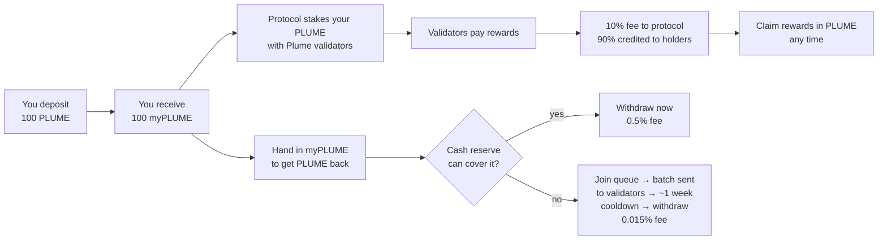
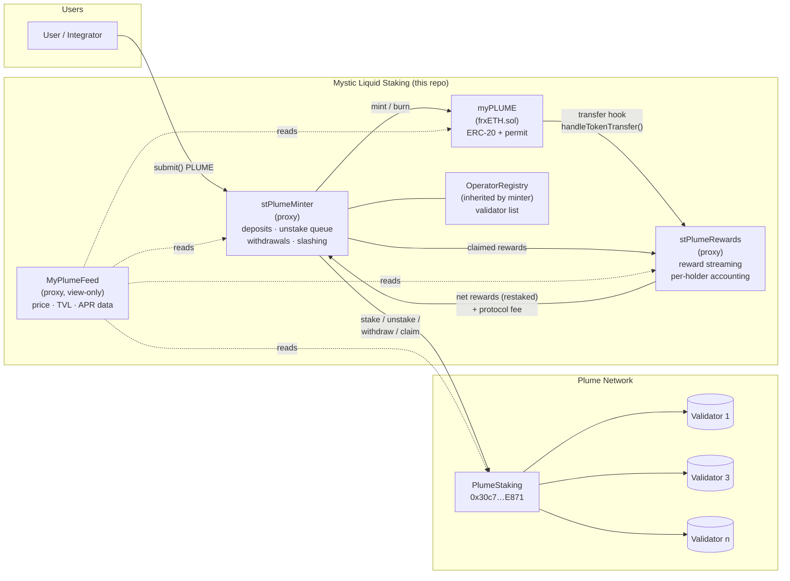
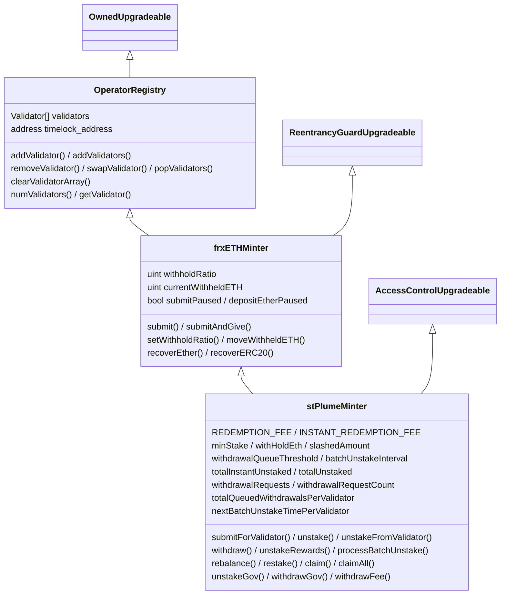
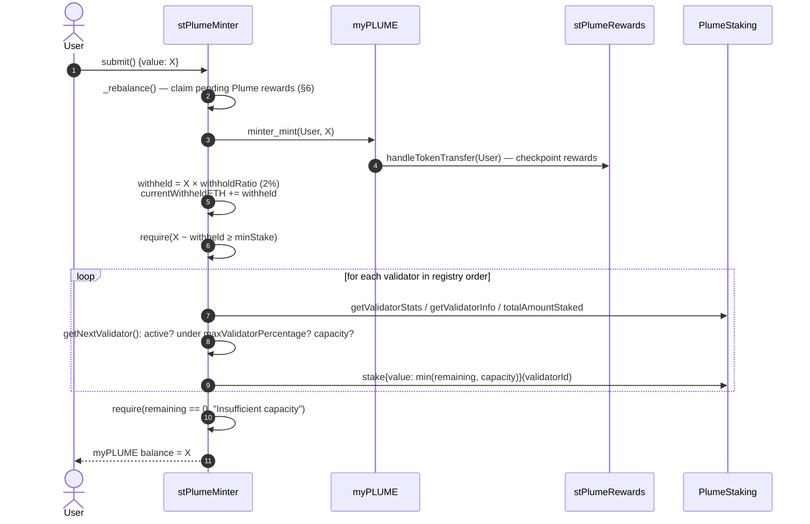
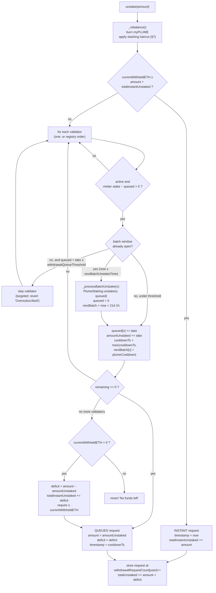
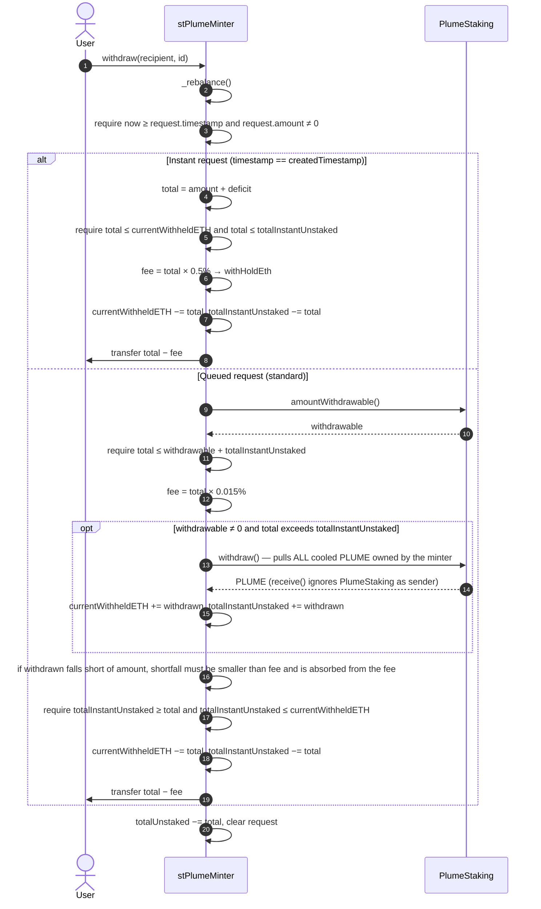
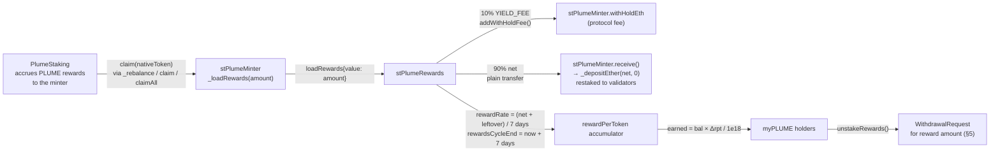
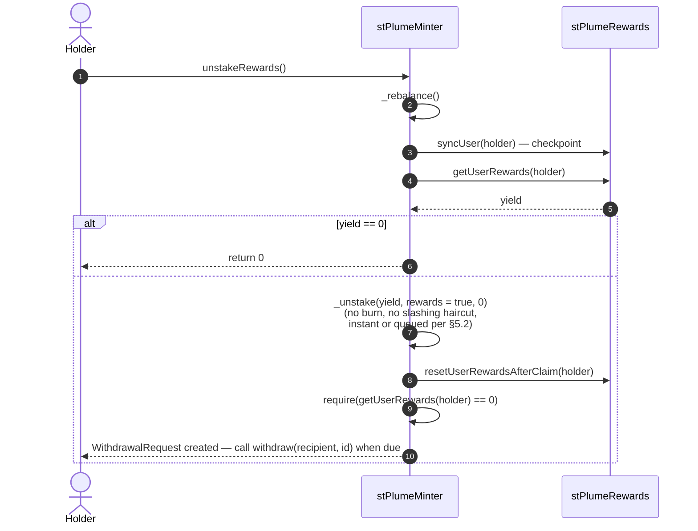
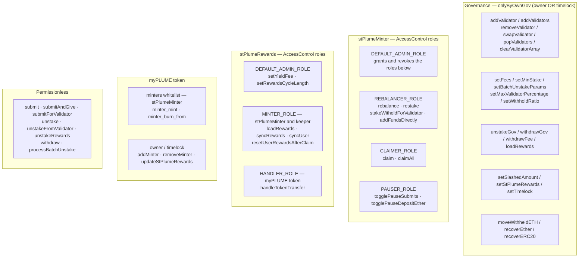

# myPLUME — Mystic Liquid Staking on Plume

**Technical documentation for the stPlumeMinter, stPlumeRewards, OperatorRegistry and periphery contracts.**

| | |
|---|---|
| Network | Plume Mainnet |
| Liquid staking token | `myPLUME` — *Mystic Staked Plume* (ERC-20, EIP-2612 permit) |
| Underlying | Native PLUME staked with Plume Network validators via the canonical `PlumeStaking` contract |
| Codebase | `src/` in this repository (branch `staked-plume`) |
| Lineage | Fork of Frax Finance `frxETH` v1 (`frxETHMinter`, `OperatorRegistry`, `ERC20PermitPermissionedMint`), extended with Plume-specific staking, unstaking, batching, rewards and slashing logic |

> **Naming note.** Several contracts and identifiers keep their Frax names (`frxETH`, `frxETHMinter`, `currentWithheldETH`, `_depositEther`, …). In this deployment every "ETH" refers to **native PLUME** and every "frxETH" refers to **myPLUME**. This document uses the Plume names in prose and the code names where a function or variable is cited.

---

## Table of contents

0. [How it works, in plain terms](#0-how-it-works-in-plain-terms)
1. [System overview](#1-system-overview)
2. [Contracts](#2-contracts)
3. [Token model](#3-token-model)
4. [Staking](#4-staking)
5. [Unstaking and withdrawal](#5-unstaking-and-withdrawal)
6. [Rewards mechanism](#6-rewards-mechanism)
7. [Slashing](#7-slashing)
8. [Operator Registry (validator management)](#8-operator-registry-validator-management)
9. [Periphery — MyPlumeFeed](#9-periphery--myplumefeed)
10. [Fees and parameters](#10-fees-and-parameters)
11. [Roles and access control](#11-roles-and-access-control)
12. [Accounting model and invariants](#12-accounting-model-and-invariants)
13. [Deployed addresses](#13-deployed-addresses)
14. [Upgradeability](#14-upgradeability)
15. [Building and testing](#15-building-and-testing)
16. [Worked examples](#16-worked-examples)
17. [Frequently asked questions](#17-frequently-asked-questions)
18. [Glossary](#18-glossary)

---

## 0. How it works, in plain terms

*This section is for readers who are not smart-contract engineers. Everything here is expanded with full technical detail in the sections that follow.*

**What problem does this solve?**
Plume is a blockchain whose native coin, PLUME, can be "staked": locked up with a validator (a computer that helps run the network) in exchange for rewards. Staking directly has two drawbacks — your coins are locked and cannot be used elsewhere, and unlocking them takes weeks. myPLUME solves both.

**What is myPLUME?**
myPLUME is a receipt token. When you deposit 100 PLUME with the protocol, you get 100 myPLUME back. The protocol stakes your PLUME with validators on your behalf. Your myPLUME is a normal token: you can hold it, send it, or use it in other applications, and it always represents the 100 PLUME you put in. Think of it like a claim ticket at a coat check — the ticket is not the coat, but it entitles you to the coat.

**How do I earn?**
The validators pay staking rewards in PLUME. The protocol collects them, keeps 10% as its fee, and shares the remaining 90% among everyone holding myPLUME, in proportion to how much each person holds and for how long. Your myPLUME balance does *not* grow; instead, your rewards build up in a separate ledger and you can cash them out in PLUME whenever you like.

**How do I get my PLUME back?**
You hand in your myPLUME (it is destroyed) and ask for PLUME. Two things can happen:

- **Fast lane.** The protocol keeps a small cash reserve (about 2% of deposits) for people who want out immediately. If the reserve can cover you, you can withdraw right away for a 0.5% fee.
- **Standard lane.** Otherwise, your request joins a queue. Roughly every three weeks the protocol sends the whole queue to the validators in one batch, the validators take about a week to release the coins, and then you can withdraw for a 0.015% fee. Total waiting time is typically between one and four weeks depending on when you joined the queue.

**What could go wrong?**
If a validator misbehaves, the network can confiscate ("slash") part of what is staked with it. Rather than letting whoever withdraws first escape the loss, the protocol spreads it evenly: every withdrawal after a slash gives back slightly less PLUME per myPLUME until the loss is fully paid for.

**Who is in control?**
A governance address (protected by a timelock) can change fees, add or remove validators, pause the system, and upgrade the contracts. A few narrower operational roles exist for automated "keeper" bots that claim rewards and rebalance funds. Ordinary users need no permission for anything.



---

## 1. System overview

myPLUME is a liquid staking token for the Plume network. Users deposit native PLUME into `stPlumeMinter`, receive myPLUME 1:1, and the minter stakes the PLUME across a curated set of Plume validators. Staking rewards are claimed from Plume, a protocol fee is taken, and the remainder is streamed to myPLUME holders pro-rata through a Synthetix-style reward accumulator (`stPlumeRewards`). Holders can redeem myPLUME for PLUME either instantly from a liquidity buffer (with a higher fee) or through a batched unstake queue that respects the Plume validator cooldown.



**Key design properties**

- **Non-rebasing, 1:1 principal token.** One myPLUME always represents one PLUME of *principal*. Yield is not folded into the token balance or an exchange rate; it is tracked per holder in `stPlumeRewards` and paid out in PLUME on demand.
- **Two redemption paths.** *Instant* (from the withheld liquidity buffer, 0.5% fee) and *standard* (batched validator unstake + Plume cooldown, 0.015% fee).
- **Batched validator unstaking.** Unstake requests against a validator are aggregated and pushed to `PlumeStaking` once per `batchUnstakeInterval` (21 days + 1 hour), so a single Plume cooldown covers the whole batch.
- **Rewards are restaked.** Net staking rewards are re-deposited into validators the moment they are claimed, so the reward pool itself keeps earning until holders claim it.
- **Socialised slashing.** A governance-recorded `slashedAmount` is applied pro-rata to every redemption until the loss is fully absorbed.
- **Upgradeable.** `stPlumeMinter`, `stPlumeRewards` and `MyPlumeFeed` sit behind OpenZeppelin `TransparentUpgradeableProxy` with a shared `ProxyAdmin`.

---

## 2. Contracts

| Contract | File | Type | Purpose |
|---|---|---|---|
| `frxETH` (myPLUME) | `src/frxETH.sol` | Non-upgradeable ERC-20 | The liquid staking token. Permissioned mint/burn by whitelisted minters. Notifies `stPlumeRewards` on every transfer so reward checkpoints are exact. |
| `ERC20PermitPermissionedMint` | `src/ERC20/ERC20PermitPermissionedMint.sol` | Abstract base | OZ `ERC20Permit` + `ERC20Burnable` + Synthetix `Owned`, with a minter whitelist. |
| `stPlumeMinter` | `src/stPlumeMinter.sol` | Upgradeable (proxy) | Core protocol contract. Accepts PLUME, mints myPLUME, allocates stake to validators, runs the unstake queue and withdrawal logic, holds the liquidity buffer and protocol fees, applies slashing. |
| `frxETHMinter` | `src/frxETHMinter.sol` | Abstract base | Frax base minter: `submit()`, withhold ratio, pause flags, emergency recovery. |
| `OperatorRegistry` | `src/OperatorRegistry.sol` | Abstract base | Ordered list of Plume validator IDs the minter may stake to; owner/timelock managed. |
| `stPlumeRewards` | `src/stPlumeRewards.sol` | Upgradeable (proxy) | Synthetix `StakingRewards`-derived accumulator. Takes the protocol yield fee, streams net rewards over a 7-day cycle, tracks each holder's earned PLUME. |
| `MyPlumeFeed` | `src/Periphery/MyPlumeFeed.sol` | Upgradeable (proxy), view-only | Read-only aggregator for integrators and oracles: price, TVL, staked amount, accrued rewards, liquidity ratio, fees. |
| `IPlumeStaking` / `PlumeStakingStorage` | `src/interfaces/` | Interfaces | ABI of the external Plume Network staking contract. |
| `stPlumeRewardsLegacy`, `sfrxETH`, `DepositContract` | `src/` | Not in use | Retained for history / tests. `sfrxETH` (ERC-4626 vault) is **not deployed** on Plume. |

### Inheritance



---

## 3. Token model

`myPLUME` is a plain ERC-20 (name *Mystic Staked Plume*, symbol `myPLUME`, 18 decimals) with EIP-2612 permits.

- **Minting** happens only in `stPlumeMinter._submit()`, at exactly `msg.value` — 1 myPLUME per 1 PLUME deposited, *before* the withhold ratio is applied. The withheld portion stays in the minter as user-owned liquidity; it is not a fee.
- **Burning** happens only in `stPlumeMinter._unstake()` when a holder redeems.
- **No rebasing, no exchange rate.** `balanceOf` never changes on its own. A holder's yield is `stPlumeRewards.getUserRewards(holder)`, denominated in PLUME, and is claimed via `stPlumeMinter.unstakeRewards()`.
- **Transfer hook.** `frxETH._beforeTokenTransfer` calls `stPlumeRewards.handleTokenTransfer(from)` and `handleTokenTransfer(to)` (skipping the zero address and the token itself). This checkpoints both parties' `rewardPerToken` *before* balances change, which is what makes the Synthetix accounting exact under transfers, mints and burns.
- **Reference price.** Because principal is 1:1, the fair price reported by `MyPlumeFeed.getMyPlumePrice()` is the protocol's net PLUME backing divided by supply and is expected to sit at ≈ 1.0 PLUME, moving below 1.0 only if a slashing loss has been recorded and not yet fully absorbed.

---

## 4. Staking

> **In plain terms.** Deposit PLUME, get the same number of myPLUME. The protocol keeps 2% of your deposit as a cash reserve (still yours, just not staked) and stakes the other 98% with validators, filling them in a priority order set by governance and never letting one validator become too dominant. Deposits smaller than 0.1 PLUME are refused.

### Entry points

| Function | Who | Behaviour |
|---|---|---|
| `submit()` | anyone, `payable` | Mint myPLUME to `msg.sender`; stake across validators in registry order. |
| `submitAndGive(address recipient)` | anyone, `payable` | Same, but mint to `recipient`. |
| `submitForValidator(uint16 validatorId)` | anyone, `payable` | Mint to `msg.sender`; stake the whole deposit to one specific registered validator. |
| `receive()` | anyone | Plain PLUME transfer to the minter behaves like `submit()`. Transfers from `PlumeStaking`, the Plume treasury and `stPlumeRewards` are treated specially (see §6). |

All paths require `!submitPaused`, `msg.value > 0`, and the post-withhold amount to be `≥ minStake` (0.1 PLUME).

### Sequence



### Allocation rules (`_depositEther`, `getNextValidator`)

1. Amounts below `minStake` are never sent to a validator; they are added to `currentWithheldETH` (this is the normal path for small reward top-ups).
2. **Targeted deposit** (`validatorId != 0`): the validator must be active and have enough remaining capacity for the *entire* amount, otherwise the call reverts (`"Validator capacity exceeded"` / `"No capacity"`).
3. **Round-robin deposit** (`validatorId == 0`): the registry is walked from index 0. A validator is skipped if it is inactive, if its share of *network-wide* stake after this deposit would exceed `maxValidatorPercentage[validatorId]` (when set), or if its remaining capacity is below `minStake`. Otherwise `min(remaining, capacity)` is staked and the loop continues. If any amount is left after the last validator, the whole transaction reverts.
4. Validator capacity comes from `PlumeStaking.getValidatorInfo().maxCapacity`; a value of `0` means unlimited.
5. `depositEtherPaused` blocks all staking (and, because `_rebalance` checks it too, every user-facing action).

### Liquidity buffer

`withholdRatio` (2%) of every deposit is kept in the minter as `currentWithheldETH`. This buffer:

- funds **instant redemptions** (§5),
- covers **deficits** when validators cannot absorb a queued unstake,
- can be pushed to validators later by `REBALANCER_ROLE` via `stakeWitheldForValidator(amount, validatorId)` (which enforces `currentWithheldETH − amount ≥ totalInstantUnstaked`, i.e. never below what is already promised to pending instant withdrawals).

---

## 5. Unstaking and withdrawal

> **In plain terms.** Getting PLUME back is a two-step process — first you *unstake* (hand in your myPLUME and get a numbered ticket), then later you *withdraw* (redeem the ticket for PLUME). If the cash reserve can pay you, the ticket is redeemable immediately for a 0.5% fee. If not, the ticket is dated: the protocol bundles everyone's requests and sends them to validators about every three weeks, the validators take about a week to release the coins, and then the ticket becomes redeemable for a 0.015% fee. Anyone can trigger the batch once it is due; there is no reliance on the team to do it.

Redemption is a two-step process: **unstake** (burn myPLUME, create a `WithdrawalRequest`) then **withdraw** (claim PLUME once the request's timestamp is reached).

```solidity
struct WithdrawalRequest {
    uint256 amount;            // portion sourced from validators (or buffer, on the instant path)
    uint256 deficit;           // portion reserved from currentWithheldETH because validators could not cover it
    uint256 timestamp;         // earliest time withdraw() succeeds
    uint256 createdTimestamp;  // block.timestamp at creation; == timestamp ⇒ instant request
}
mapping(address => mapping(uint256 => WithdrawalRequest)) public withdrawalRequests;
mapping(address => uint256) public withdrawalRequestCount;   // next request id for a user
```

### 5.1 Unstake entry points

| Function | Who | Behaviour |
|---|---|---|
| `unstake(uint256 amount)` | holder | Burn `amount` myPLUME; source PLUME from the buffer or from validators in registry order. |
| `unstakeFromValidator(uint256 amount, uint16 validatorId)` | holder | Same, but the validator portion must come from one specific validator (reverts if it cannot fulfil). |
| `unstakeRewards()` | holder | Claim accrued rewards (§6.4). No burn; a withdrawal request for the reward amount is created through the same logic. |

Both principal paths require `amount ≥ minStake`.

### 5.2 Decision flow



**Reading the flow**

- **Instant path** is taken only when the buffer can cover *both* this request and every instant/deficit amount already promised (`totalInstantUnstaked`). The request is immediately withdrawable.
- **Queued path** walks validators. For each, the amount the minter can still pull is `stake − alreadyQueued`. The request's `timestamp` is the *latest* `nextBatchUnstakeTime + PlumeStaking.getCooldownInterval()` across the validators it touched — i.e. the time by which the batch containing this request will have been pushed to Plume *and* Plume's cooldown will have elapsed.
- **Queue threshold.** Before a validator's batch window opens, at most `withdrawalQueueThreshold` (100,000 PLUME) may be queued against it. Round-robin unstakes simply skip a saturated validator; targeted unstakes revert.
- **Deficit.** Any residual the validators cannot cover is earmarked from the buffer and paid at withdrawal time together with the validator portion.

### 5.3 Batch processing

`processBatchUnstake()` is **permissionless**. For every registered validator that is active and whose `nextBatchUnstakeTimePerValidator` has passed, it calls `PlumeStaking.unstake(validatorId, totalQueuedWithdrawalsPerValidator[validatorId])`, zeroes the queue and schedules the next window `batchUnstakeInterval` later. The same processing is triggered lazily inside `_unstake` when a user's request lands on a validator whose window is already open.

```mermaid
gantt
    title Lifecycle of one validator's unstake queue (illustrative)
    dateFormat  X
    axisFormat  day %s
    section Queue window
    Requests accumulate (≤ withdrawalQueueThreshold)   :active, q, 0, 21
    section Plume
    processBatchUnstake → PlumeStaking.unstake(v, total) :milestone, m, 21, 0
    Plume cooldown (getCooldownInterval)                 :c, 21, 28
    Funds withdrawable via PlumeStaking.withdraw()       :milestone, w, 28, 0
    section Next window
    Requests accumulate                                  :q2, 21, 42
```



Governance can force-process a validator ahead of schedule with `unstakeGov(validatorId, extraAmount)`, which unstakes `queued + extraAmount` and resets the window; and can pull cooled funds into the buffer with `withdrawGov()`.

### 5.4 Withdrawal



Notes:

- `PlumeStaking.withdraw()` is *all-or-nothing* for the minter's cooled balance. Any PLUME pulled beyond the current request is parked in `currentWithheldETH` and mirrored in `totalInstantUnstaked`, so it is reserved for other pending withdrawals rather than being re-staked.
- Fees on both paths accrue to `withHoldEth` and are collected by governance with `withdrawFee()`.
- A user may hold several requests; each is addressed by its sequential `id` and can be withdrawn to any `recipient`.

---

## 6. Rewards mechanism

> **In plain terms.** Validators pay rewards to the protocol in PLUME. Each time rewards are collected, 10% goes to the protocol's fee balance and 90% is credited to myPLUME holders, drip-fed evenly over the following 7 days so nobody can time a large reward payout. Your share is proportional to how much myPLUME you hold, second by second — if you send half your myPLUME to a friend, you stop earning on that half and they start, from that moment. The reward PLUME itself is put back to work with validators until you claim it. Claiming turns your rewards into a normal withdrawal ticket (fast lane or standard lane, as above).

### 6.1 Overview



### 6.2 Collection

Rewards are pulled from Plume in native PLUME (`nativeToken = 0xEeee…EEeE`). Three routes exist:

| Route | Trigger | Detail |
|---|---|---|
| `_rebalance()` | Automatically at the start of every user action (`submit`, `unstake`, `withdraw`, `unstakeRewards`) and admin action; also explicitly via `rebalance()` (`REBALANCER_ROLE`) | Calls `PlumeStaking.claim(nativeToken)` inside `try/catch` only if `getClaimableReward() ≥ minStake`. A revert on Plume's side never blocks the user's transaction. |
| `claim(validatorId)` / `claimAll()` | `CLAIMER_ROLE` (keeper) | Direct claim from one validator or all. Non-native reward tokens from `claimAll()` remain in the minter to be handled by governance via `recoverERC20`. |
| `loadRewards()` | governance, `payable` | Manual injection of PLUME as rewards (e.g. converted ERC-20 rewards or incentives). |

Every route ends in `stPlumeMinter._loadRewards(amount)` → `stPlumeRewards.loadRewards{value: amount}()`.

### 6.3 Distribution (Synthetix `StakingRewards`, adapted)

`stPlumeRewards` uses the well-known `rewardPerToken` / `userRewardPerTokenPaid` accumulator, with myPLUME `totalSupply()` and `balanceOf()` as the staked-token quantities (no separate staking step is needed — holding myPLUME *is* being staked).

```solidity
// on every loadRewards()
yieldAmount = reward × YIELD_FEE / 1e6;          // 10% → minter.withHoldEth
netReward   = reward − yieldAmount;               // → minter, restaked
if (now ≥ rewardsCycleEnd)  rewardRate = netReward / rewardsCycleLength;
else                        rewardRate = (netReward + (rewardsCycleEnd − now) × rewardRate) / rewardsCycleLength;
lastSync        = now;
rewardsCycleEnd = now + rewardsCycleLength;       // 7 days

// views
rewardPerToken()  = rewardPerTokenStored + (lastTimeRewardApplicable() − lastSync) × rewardRate × 1e18 / totalSupply
getUserRewards(u) = balanceOf(u) × (rewardPerToken() − userRewardPerTokenPaid[u]) / 1e18 + userRewards[u]
```

Properties:

- **Linear streaming.** Each load restarts a 7-day cycle; unstreamed remainder from the previous cycle rolls into the new rate. Holders therefore see a smooth accrual rather than step changes.
- **Exact pro-rata accounting.** `updateReward(account)` runs on `loadRewards`, on every myPLUME transfer/mint/burn (via `handleTokenTransfer`, `HANDLER_ROLE` = the token), and on `syncUser`. No holder can gain or lose accrued rewards by transferring tokens.
- **Rewards are held as staked PLUME.** The net reward PLUME is sent back to the minter, whose `receive()` recognises the rewards contract as sender and calls `_depositEther(net, 0)`. The reward pool is therefore staked with validators (or, when below `minStake`, parked in the buffer) and earns further yield for the protocol until claimed.
- **Fee bound.** `setYieldFee` caps `YIELD_FEE` at 50%. `setRewardsCycleLength` (1–365 days) may only change between cycles.

### 6.4 Claiming rewards



Because the reward PLUME is physically staked, a reward claim is fulfilled exactly like a principal redemption: from the buffer if liquidity allows (instant, 0.5% fee) or through the batched validator queue (standard, 0.015% fee).

---

## 7. Slashing

> **In plain terms.** If the network confiscates part of the protocol's stake because a validator misbehaved, governance records the size of the loss. From then on, everyone who withdraws gets back proportionally less until the loss has been fully shared out. This prevents a "bank run" where early withdrawers escape whole and late withdrawers carry the entire loss. Reward claims are not reduced.

Plume validators can be slashed. The protocol socialises any such loss across all holders rather than letting the first redeemers exit whole.

- Governance records the loss with `setSlashedAmount(uint256)` (`onlyByOwnGov`). This is an accounting entry; the PLUME is already gone from the minter's validator stake.
- On every **principal** unstake, after burning `amount` myPLUME:

  ```solidity
  S         = totalSupply() + amount;            // supply before this burn
  newAmount = amount × (S − slashedAmount) / S;  // redeemer's pro-rata haircut
  slashedAmount −= (amount − newAmount);         // loss absorbed so far
  ```

  The holder receives `newAmount` of PLUME for `amount` of myPLUME. Each redemption absorbs its share; when `slashedAmount` reaches 0 the haircut disappears.
- Reward claims (`unstakeRewards`) are **not** haircut.
- `MyPlumeFeed.getMyPlumePrice()` reflects the loss immediately, since it is derived from real backing (`PlumeStaking.stakeInfo` + buffer), not from `slashedAmount`.

---

## 8. Operator Registry (validator management)

> **In plain terms.** This is the protocol's list of approved validators, in priority order. Governance decides who is on it and in what order. New deposits go to the first validator on the list that has room; withdrawals are pulled from the list in the same order. Governance can also cap how large a share of the whole Plume network any one validator may hold through this protocol.

`OperatorRegistry` holds an **ordered array** of Plume validator IDs. The order matters: round-robin deposits and unstakes walk the array from index 0, so index 0 is the highest-priority validator for both inflows and outflows.

```solidity
struct Validator { uint256 validatorId; }
Validator[] validators;
```

| Function | Access | Behaviour |
|---|---|---|
| `addValidator(Validator)` | owner / timelock | **Overridden in `stPlumeMinter`:** rejects duplicates and initialises `nextBatchUnstakeTimePerValidator[id] = now + PlumeStaking.getCooldownInterval()`. |
| `addValidators(Validator[])` | owner / timelock | Batch add (calls the overridden `addValidator`). |
| `swapValidator(from_idx, to_idx)` | owner / timelock | Reorder priority. |
| `popValidators(times)` | owner / timelock | Remove from the end. |
| `removeValidator(idx, dont_care_about_ordering)` | owner / timelock | Swap-and-pop (cheap) or order-preserving rebuild. |
| `clearValidatorArray()` | owner / timelock | Empty the list. |
| `numValidators()`, `getValidator(i)`, `getValidatorStruct(id)` | view | Introspection helpers. |
| `setTimelock(address)` | owner / timelock | Rotate the timelock. |

**Per-validator controls in `stPlumeMinter`**

| State / setter | Meaning |
|---|---|
| `maxValidatorPercentage[id]` via `setMaxValidatorPercentage(id, pct)` (1e6 = 100%) | Upper bound on the validator's share of *total network stake* after a deposit; prevents the protocol from over-concentrating a single validator. `0` = no cap. |
| `totalQueuedWithdrawalsPerValidator[id]` | PLUME queued for the next batch unstake. |
| `nextBatchUnstakeTimePerValidator[id]` | When the next batch may be pushed to Plume. |
| `restake(id, amount)` (`REBALANCER_ROLE`) | Move the minter's *cooling/parked* PLUME on Plume back into a validator without it leaving Plume. |
| `stakeWitheldForValidator(amount, id)` (`REBALANCER_ROLE`) | Push buffer PLUME into a validator. |
| `addFundsDirectly(id)` (`REBALANCER_ROLE`, `payable`) | Inject PLUME into a validator (or the buffer if `id == 0`) **without minting** — used to top up backing. |

Removing a validator from the registry does **not** unstake from it; governance should `unstakeGov` / `withdrawGov` and `restake` as needed. Validity of a validator ID is not checked on-chain beyond `PlumeStaking` reverting on stake.

---

## 9. Periphery — MyPlumeFeed

> **In plain terms.** A read-only "dashboard" contract. It does not hold or move any money; it just adds up numbers from the other contracts so that wallets, price oracles (such as Chainlink) and analytics sites can ask one place for "how much PLUME backs each myPLUME?", "how much is staked?", "how much reward has been earned?", and "how much can be withdrawn instantly right now?".

`MyPlumeFeed` is a stateless, view-only proxy contract that composes the numbers integrators and price feeds need. It reads `myPLUME`, `stPlumeMinter`, `stPlumeRewards` and `PlumeStaking` and never mutates state.

| Function | Returns |
|---|---|
| `getMyPlumeTvl()` | `myPLUME.totalSupply()` — principal outstanding. |
| `getTotalDeposits()` | Net PLUME backing = `staked + cooled + parked` (per `PlumeStaking.stakeInfo(minter)`) `+ currentWithheldETH − totalUnstaked − getMyPlumeRewards()`. Pending withdrawals and accrued-but-unclaimed rewards are excluded because they are owed, not backing. |
| `getMyPlumePrice()` | `getTotalDeposits() × 1e18 / totalSupply()` — PLUME per myPLUME, 18 decimals. Expected ≈ `1e18`; lower after an unabsorbed slashing loss. |
| `getPlumeStakedAmount()` | PLUME actively staked with validators. |
| `getMyPlumeRewards()` | Total rewards streamed to holders so far: `rewardPerToken() × totalSupply() / 1e18`. |
| `totalRewards()` | Streamed rewards plus the net (post-fee) rewards currently claimable from Plume but not yet loaded. |
| `getEffectiveYield()` | `stPlumeRewards.getYield()` (= `rewardPerToken()`), a monotonically increasing per-token index for off-chain APR computation. |
| `getMinterStats()` | Raw `PlumeStakingStorage.StakeInfo` for the minter (staked / cooled / parked). |
| `getRedemptionFees()` | `(REDEMPTION_FEE, INSTANT_REDEMPTION_FEE)` in 1e6 precision. |
| `getCurrentWithheldETH()`, `getTotalInstantUnstaked()` | Buffer size and the amount of it already promised. |
| `getLiquidityRatio()` | `currentWithheldETH × 1e18 / getTotalDeposits()` — instant-redemption capacity as a share of backing. |

**Guidance for oracle consumers.** `getMyPlumePrice()` is a fundamental (backing-based) price, not a market price. It moves only through (a) rounding of the withhold/fee arithmetic, (b) `addFundsDirectly` top-ups, and (c) slashing losses. A deviation materially below `1e18` should be treated as a signal that a loss has been recorded.

---

## 10. Fees and parameters

All ratios use `RATIO_PRECISION = 1e6`.

| Parameter | Contract | Default | Bounds / setter | Purpose |
|---|---|---|---|---|
| `withholdRatio` | minter | `20000` (2%) | ≤ 100%, `setWithholdRatio` (gov) | Share of each deposit kept liquid for instant redemptions. **Not a fee.** |
| `YIELD_FEE` | rewards | `100000` (10%) | ≤ 50%, `setYieldFee` (admin) | Protocol take on staking rewards. |
| `REDEMPTION_FEE` | minter | `150` (0.015%) | ≤ 100%, `setFees` (gov) | Fee on standard (queued) withdrawals. |
| `INSTANT_REDEMPTION_FEE` | minter | `5000` (0.5%) | ≤ 100%, `setFees` (gov) | Fee on instant withdrawals from the buffer. |
| `minStake` | minter | `0.1 PLUME` | ≥ `PlumeStaking.getMinStakeAmount()`, `setMinStake` (gov) | Minimum deposit / unstake; dust threshold for validator deposits and reward claims. |
| `withdrawalQueueThreshold` | minter | `100,000 PLUME` | ≥ 1 PLUME, `setBatchUnstakeParams` (gov) | Max PLUME queued per validator before its batch window opens. |
| `batchUnstakeInterval` | minter | `21 days + 1 hour` | 1 h – 365 d, `setBatchUnstakeParams` (gov) | Spacing between batch unstakes per validator. |
| `rewardsCycleLength` | rewards | `7 days` | 1 – 365 d, between cycles only | Streaming period for each reward load. |
| `maxValidatorPercentage[id]` | minter | `0` (none) | ≤ 100%, `setMaxValidatorPercentage` (gov) | Concentration cap per validator. |

Protocol fee balance is `withHoldEth`; it is withdrawn to `owner` by `withdrawFee()` (gov).

---

## 11. Roles and access control

> **In plain terms.** Three tiers of control exist. **Governance** (an owner address and a timelock) can change every setting, manage validators, pause, and upgrade. **Operational roles** are narrow permissions given to automated keeper bots — one can collect rewards, one can rebalance funds between the reserve and validators, one can hit the pause switch. **Everyone else** can deposit, withdraw, claim rewards and trigger the batch queue without permission.



Emergency powers worth noting for reviewers: `recoverEther` and `moveWithheldETH` (gov) can move PLUME out of the minter without accounting updates; `setSlashedAmount` is unbounded; `ProxyAdmin` can replace implementations. All are gated to the owner/timelock.

Pausing: `submitPaused` stops new deposits only. `depositEtherPaused` stops staking **and**, because `_rebalance()` requires it to be false, stops every user-facing function — it is effectively a global pause.

---

## 12. Accounting model and invariants

> **In plain terms.** The protocol keeps a handful of running totals so that it always knows how much PLUME is sitting in its reserve, how much of that reserve is already spoken for by pending withdrawals, how much is owed to people holding tickets, and how much belongs to the protocol as fees. The "invariants" are the rules that must always hold between these totals — for example, the reserve may never be promised to more people than it can pay.

Balances tracked by the minter:

| Variable | Meaning |
|---|---|
| `currentWithheldETH` | Liquid PLUME held by the minter that belongs to holders (buffer + cooled funds pulled from Plume + dust). |
| `totalInstantUnstaked` | Portion of `currentWithheldETH` already promised to pending withdrawals (instant requests, deficits, and cooled funds pulled from Plume). |
| `totalUnstaked` | Sum of all open `WithdrawalRequest` amounts (`amount + deficit`), across instant and queued. Subtracted from backing in the feed. |
| `withHoldEth` | Protocol fee balance (yield fee + redemption fees). Not holder money. |
| `slashedAmount` | Unabsorbed socialised loss. |
| `totalQueuedWithdrawalsPerValidator[id]` | Queued but not yet pushed to Plume. |

Invariants the code enforces or relies on:

1. `totalInstantUnstaked ≤ currentWithheldETH` (checked in `_unstake`, `_withdraw`, `_stakeWitheldForValidator`).
2. `address(this).balance ≥ currentWithheldETH + withHoldEth` (relied upon; `recoverEther` / `moveWithheldETH` are the only gov paths that can break it).
3. `myPLUME.totalSupply() ≈ stakeInfo.staked + cooled + parked + currentWithheldETH − totalUnstaked − streamedRewards + slashedAmount` — i.e. the feed price ≈ 1 before slashing.
4. A queued request's `timestamp` is never earlier than the moment its batch will have completed the Plume cooldown.
5. Reward checkpoints are taken before every balance change of myPLUME, so `Σ getUserRewards ≤ rewards loaded − fees`.

---

## 13. Deployed addresses

Plume mainnet, current production deployment ("Launched Mainnet" in `script/deployMinter.s.sol` and `script/deployPeriphery.s.sol`):

| Contract | Address |
|---|---|
| myPLUME token (`frxETH.sol`) | `0xc2387E0feA344D1edEC3E93Bf2124f909f74938C` |
| stPlumeMinter (proxy) | `0xAD8874006ee4EBe311066E47c650A74171b8F624` |
| stPlumeRewards (proxy) | `0x6B9D6efF3f9B15b0655C5f5c2f27Fcc9A87f9087` |
| MyPlumeFeed (proxy) | `0xFbb53aa72c10680e822e255aC70D10f8bb957D64` |
| ProxyAdmin | `0x99E18E728497c4732b68D27417A8b7e4dcf70080` |
| Timelock | `0x474302838E35DfC33967bA99AbbcB7560D48C634` |
| PlumeStaking (Plume Network, external) | `0x30c791E4654EdAc575FA1700eD8633CB2FEDE871` |
| Native token sentinel (`nativeToken`) | `0xEeeeeEeeeEeEeeEeEeEeeEEEeeeeEeeeeeeeEEeE` |

Registered validator IDs at deployment (priority order): `3, 9, 8, 5, 1`. The live list is `stPlumeMinter.getValidator(i)` for `i < numValidators()`.

Earlier test deployments are listed as comments in the deploy scripts and are not in use.

---

## 14. Upgradeability

- `stPlumeMinter`, `stPlumeRewards` and `MyPlumeFeed` are OpenZeppelin `TransparentUpgradeableProxy` instances administered by the shared `ProxyAdmin` above. Implementations disable initializers in their constructors.
- Storage layouts reserve `__gap` slots in `OperatorRegistry` (10), `frxETHMinter` (10), `stPlumeMinter` (49) and `stPlumeRewards` (50).
- `myPLUME` is **not** upgradeable; its only mutable wiring is the minter whitelist and the `stPlumeRewards` hook address.
- Upgrade path: `script/upgradeMinter.s.sol` deploys a new implementation and calls `ProxyAdmin.upgrade`. Storage-compatibility is exercised by `test/fork/UpgradeTests.t.sol` against mainnet state.

---

## 15. Building and testing

```bash
git clone --recurse-submodules https://github.com/mystic-finance/Liquid-Staking.git
cd Liquid-Staking && git checkout staked-plume
forge install && forge build
```

Tests are fork tests against Plume mainnet (public RPC `https://rpc.plume.org`). The `Makefile` wraps the usual invocations:

```bash
make test-run-staked        # core minter suite       (StPlumeMinterForkTestMain)
make test-run-myPlumeFeed   # periphery feed          (MyPlumeFeedForkTest)
make test-run-operator      # operator registry       (OperatorRegistryForkTest)
make test-run-upgrade       # proxy upgrade safety    (UpgradeTests)
make test-run-all           # upgrade + operator + staked + feed
```

or directly:

```bash
forge test --mc StPlumeMinterForkTestMain --fork-url https://rpc.plume.org -vvv
```

Deployment and upgrade (`make deploy-minter`, `make deploy-periphery`, `make upgrade-minter`) run `script/deployMinter.s.sol`, `script/deployPeriphery.s.sol` and `script/upgradeMinter.s.sol` respectively via `forge script` with Blockscout verification against `https://explorer.plume.org`.

Static analysis:

```bash
slither ./src/stPlumeMinter.sol --solc-remaps "openzeppelin-contracts=lib/openzeppelin-contracts openzeppelin-contracts-upgradeable=lib/openzeppelin-contracts-upgradeable solmate=lib/solmate/src"
```

---

## 16. Worked examples

All numbers use the default parameters from §10. Fees are rounded for readability.

### Example A — Deposit

Alice deposits **1,000 PLUME** via `submit()`.

| Step | Effect |
|---|---|
| Mint | Alice receives **1,000 myPLUME** |
| Reserve | 2% = **20 PLUME** stays in the minter's cash reserve (`currentWithheldETH`) |
| Stake | 980 PLUME is staked. Validator 3 (first in the list) has 600 PLUME of capacity left, so 600 goes there and the remaining 380 goes to validator 9 |
| Rewards ledger | Alice's reward checkpoint is set to "now", so she starts earning from this moment |

Nothing is deducted from Alice: 1,000 PLUME went in, 1,000 myPLUME came out, and 1,000 PLUME (20 reserve + 980 staked) backs it.

### Example B — Rewards over one week

Validators pay the protocol **100 PLUME** in rewards, collected automatically when the next user transacts.

| Step | Effect |
|---|---|
| Fee | 10 PLUME → protocol fee balance (`withHoldEth`) |
| Net | 90 PLUME → sent back to the minter and staked with validators |
| Streaming | 90 PLUME is credited to holders evenly over 7 days (≈ 12.86 PLUME per day across everyone) |
| Alice's share | If Alice's 1,000 myPLUME is 1% of total supply, she earns ≈ 0.129 PLUME per day, ≈ 0.9 PLUME after the week |

If Alice transfers 500 myPLUME to Bob on day 3, her accrual rate halves from that block and Bob's begins. The 0.39 PLUME she earned in days 1–3 stays hers.

### Example C — Fast-lane redemption

Alice calls `unstake(100)`. The reserve holds 20 PLUME from her deposit plus reserves from other users — say 5,000 PLUME, with 1,000 already promised to other pending withdrawals.

| Check | Result |
|---|---|
| Burn | 100 myPLUME destroyed |
| Reserve can cover `100 + 1,000` promised? | 5,000 ≥ 1,100 → **yes, instant** |
| Ticket | id 0, `timestamp = now` |
| `withdraw(alice, 0)` | Fee 0.5% = 0.5 PLUME; Alice receives **99.5 PLUME** immediately |

### Example D — Standard-lane redemption

Later, the reserve is low. Alice calls `unstake(500)`.

| Check | Result |
|---|---|
| Burn | 500 myPLUME destroyed |
| Reserve can cover? | No → queue |
| Validator 3 | The protocol has 600 staked there and 100 already queued, so up to 500 can be queued → all 500 queued against validator 3 |
| Batch window | Validator 3's next batch is in 12 days; Plume cooldown is 7 days |
| Ticket | id 1, `timestamp = now + 12 days + 7 days` |
| Day 12 | Someone (anyone) calls `processBatchUnstake()`; the protocol asks Plume to unstake 600 PLUME (Alice's 500 + the earlier 100) from validator 3 |
| Day 19 | Alice calls `withdraw(alice, 1)`; the protocol pulls the cooled PLUME from Plume, deducts 0.015% = 0.075 PLUME, and Alice receives **499.925 PLUME** |

### Example E — Slashing

Total supply is 100,000 myPLUME and a validator is slashed for **1,000 PLUME**. Governance records `slashedAmount = 1,000`.

Bob unstakes 10,000 myPLUME:

```
S         = 100,000                       (supply before Bob's burn)
newAmount = 10,000 × (100,000 − 1,000) / 100,000 = 9,900 PLUME
slashedAmount ← 1,000 − (10,000 − 9,900) = 900
```

Bob receives a ticket for 9,900 PLUME (a 1% haircut, matching the 1% loss). The next redeemer is haircut against the remaining 900 over the remaining 90,000 supply — still 1%. Every holder bears the same proportional loss regardless of when they exit.

---

## 17. Frequently asked questions

**Does my myPLUME balance grow over time?**
No. myPLUME is not a rebasing token. Your balance stays fixed; rewards accumulate in a separate ledger (`stPlumeRewards`) and are paid in PLUME when you call `unstakeRewards()` and then `withdraw()`.

**Is 1 myPLUME always worth 1 PLUME?**
Each myPLUME is backed by 1 PLUME of principal, so the protocol's own valuation (`MyPlumeFeed.getMyPlumePrice()`) is ≈ 1.0 unless a slashing loss has been recorded and not yet absorbed. The *market* price on an exchange may differ from the backing price, as with any liquid staking token.

**Why wait up to four weeks?**
Plume validators impose a cooldown (about a week) before unstaked coins are released. On top of that, the protocol bundles requests into one batch per validator every ~3 weeks so that a single cooldown covers many users. Depending on when you join a batch, your wait is between about one week and about four.

**What happens if the validator rewards claim fails?**
Reward collection is wrapped in a `try/catch`, so a failure on Plume's side never blocks deposits, withdrawals or claims — the rewards are simply collected next time.

**Can I choose which validator my PLUME goes to?**
Yes: `submitForValidator(validatorId)` stakes your whole deposit with one specific approved validator, and `unstakeFromValidator` pulls from a specific one. The default `submit()` / `unstake()` let the protocol choose.

**What can the automated keeper do?**
Only claim rewards from Plume, rebalance PLUME between the reserve and validators, and trigger reward syncs. It cannot mint tokens, move funds to outside addresses, or change fees.

---

## 18. Glossary

| Term | Meaning |
|---|---|
| **PLUME** | The native coin of the Plume network. |
| **myPLUME** | Mystic's liquid staking token; a 1:1 receipt for PLUME deposited into the protocol. Called `frxETH` in the source code. |
| **Staking** | Locking PLUME with a validator to help secure the network in exchange for rewards. |
| **Validator** | A node operator on Plume. The protocol maintains a governance-approved, priority-ordered list of validator IDs. |
| **PlumeStaking** | Plume Network's own staking contract, which the protocol talks to. External to this codebase. |
| **Liquid staking token (LST)** | A token that represents staked assets but remains freely transferable. |
| **Minter** | `stPlumeMinter`, the contract that accepts PLUME, issues myPLUME and manages staking and withdrawals. Called "minter" because it is the only address allowed to mint or burn myPLUME. |
| **Reserve / withheld PLUME** | The ~2% of deposits kept unstaked in the minter (`currentWithheldETH`) to fund instant withdrawals. |
| **Instant (fast-lane) withdrawal** | A withdrawal paid straight from the reserve, available immediately, 0.5% fee. |
| **Standard (queued) withdrawal** | A withdrawal fulfilled by unstaking from validators after the batch window and Plume cooldown, 0.015% fee. |
| **Withdrawal request / ticket** | The on-chain record (`WithdrawalRequest`) created when you unstake; redeemed with `withdraw(recipient, id)`. |
| **Deficit** | The part of a queued withdrawal that validators could not supply and that is instead reserved from the reserve. |
| **Batch unstake** | Sending all queued withdrawal requests for a validator to Plume in one transaction, once every `batchUnstakeInterval` (~3 weeks). |
| **Cooldown** | The waiting period Plume enforces between unstaking and the coins becoming withdrawable (`getCooldownInterval()`, ~1 week). |
| **Queue threshold** | The maximum PLUME (100,000) that may be queued against a single validator before its batch window opens. |
| **Rewards contract** | `stPlumeRewards`; keeps the per-holder ledger of earned rewards. |
| **Reward cycle** | The 7-day period over which each batch of collected rewards is streamed to holders. |
| **rewardPerToken** | The running index used by the Synthetix accounting model: total rewards ever streamed per unit of myPLUME. A holder's earnings are their balance × the change in this index since their last checkpoint. |
| **Checkpoint** | Recording a holder's rewards at the moment their balance changes, so transfers never gain or lose rewards. |
| **Yield fee** | The protocol's 10% cut of staking rewards. |
| **Slashing** | Confiscation of staked coins by the network as a penalty for validator misbehaviour. |
| **Socialised loss** | Spreading a slashing loss evenly across all holders via a pro-rata haircut on redemptions. |
| **Governance / owner / timelock** | The addresses allowed to change protocol settings. The timelock enforces a delay on sensitive changes. |
| **Keeper** | An automated bot holding a narrow operational role (claiming rewards, rebalancing). |
| **Proxy / upgradeable** | A pattern where the contract's address stays fixed while its code can be replaced by the `ProxyAdmin`. |
| **Feed** | `MyPlumeFeed`, the read-only contract that reports price, TVL and reward figures for integrators. |
| **TVL** | Total value locked — here, the total myPLUME supply, i.e. total PLUME principal deposited. |

---

*Maintained by Mystic Finance. Contracts are licensed AGPL-3.0-only unless otherwise noted in the file header; Frax-derived components retain their original attribution.*
